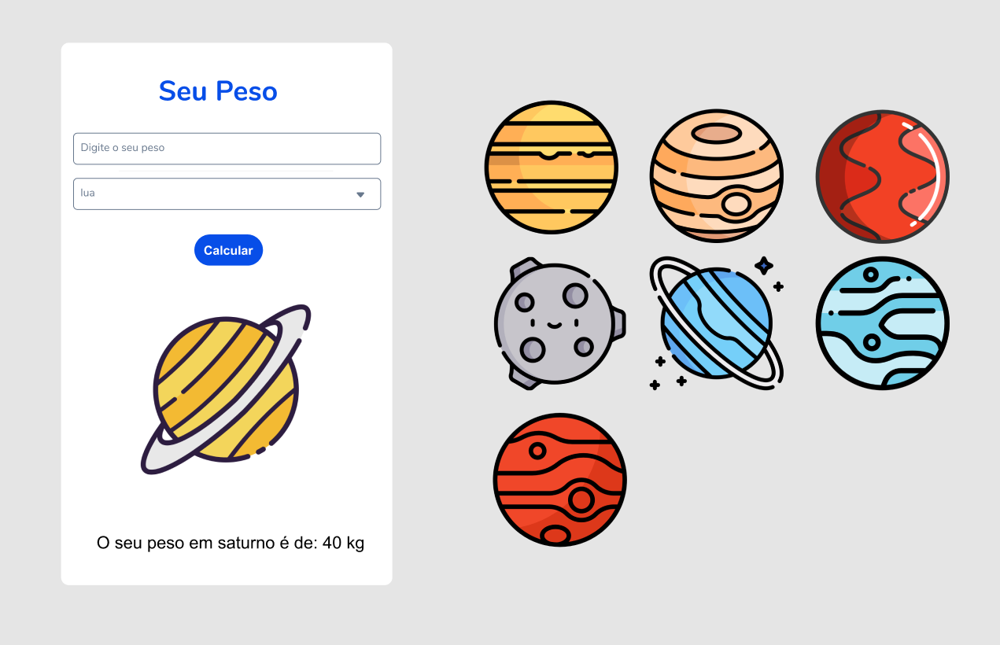

<h1> Projeto de peso nos planetas <h1> 

  > Status: Concluido ✔️
  
  ### Esse projeto tive a ideia de fazer algo diferente, pois já que a maioria faz o Imc no inicio comecei a olhar tipos de calculadoras e encontrei de planetas então desenvolvi uma tela no figma, baixei as imagens e coloquei tudo no figma e comecei a fazer o projeto, tenho que admitir que foi um pouco difícil, mas aprendi muito. Esse trabalho é uma obra exclusiva criada por mim.
  
   
  
  <strong>Principais caracteristicas do projeto: </strong>
  
  + Imagens
  + DropDown
  + Controller
  + Calculos, Lógica
  + troca de imagens sincronizadas com o DropDown.
  
  <strong>Tecnologias usadas: </strong>
   + Flutter
  
  
      ### Imagens do projeto
   

&nbsp;&nbsp;&nbsp;&nbsp;&nbsp;&nbsp;
   
&nbsp;&nbsp;&nbsp;&nbsp;&nbsp;&nbsp;
   
&nbsp;&nbsp;&nbsp;&nbsp;&nbsp;&nbsp;
   
&nbsp;&nbsp;&nbsp;&nbsp;&nbsp;&nbsp;
   
 &nbsp;&nbsp;&nbsp;&nbsp;&nbsp;&nbsp;
   
  &nbsp;&nbsp;&nbsp;&nbsp;&nbsp;&nbsp;
   

